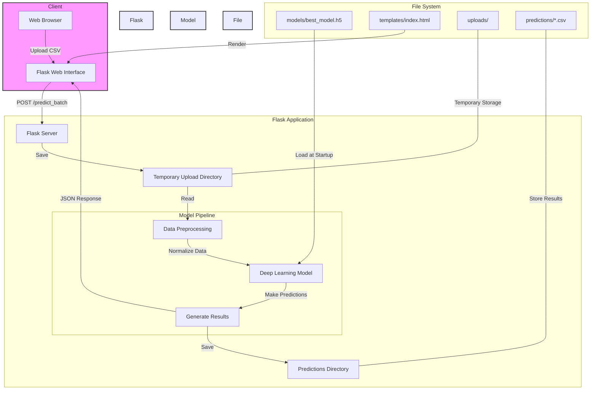
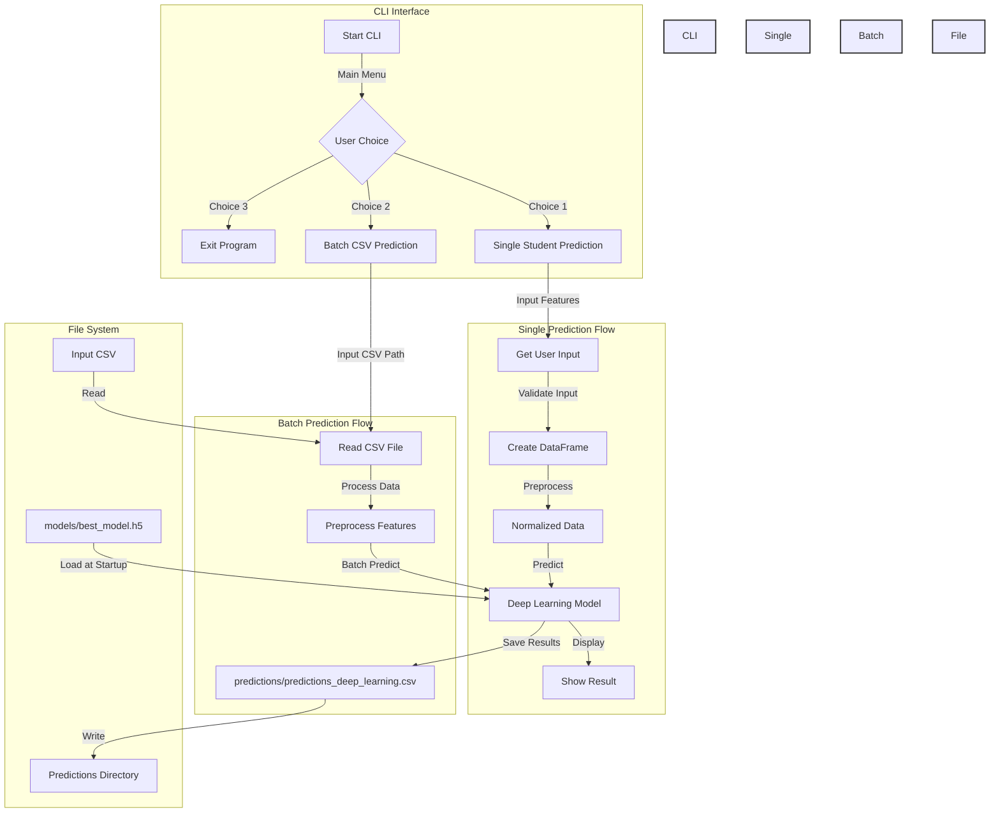

# Placement Prediction System

A machine learning system for predicting student placements using various models. The system provides both a CLI and web interface for making predictions, with separate Docker configurations for each.

## 📁 Repository Structure

```
.
├── placement_predictor_cli_app/           # CLI Application
│   ├── cli.py                    # Command-line interface
│   ├── Dockerfile                # Docker configuration for CLI
│   ├── requirements.txt          # Python dependencies for CLI
│   ├── models/                   # Trained ML models
│   │   └── trained_models.pkl    # Saved models
│   ├── predictions/              # Generated predictions
│   └── X_test.csv                # Test dataset
│
└── placement_predictor_flask_app/ # Web Application
    ├── app.py                    # Flask web application
    ├── Dockerfile                # Docker configuration for web app
    ├── requirements.txt          # Python dependencies for web app
    ├── models/                   # Trained ML models
    ├── templates/                # HTML templates
    ├── uploads/                  # Temporary upload directory
    ├── predictions/              # Generated predictions
    └── testdata.csv              # Test dataset
```

## 🚀 Setup and Installation

### Prerequisites

- Docker
- Git

### CLI Application Setup

1. Build the CLI Docker image:

```bash
cd placement_predictor
docker build -t placement-predictor-cli .
```

2. Run the CLI application:

```bash
docker run placement-predictor-cli
```

### Web Application Setup

1. Build the web application Docker image:

```bash
cd placement_predictor_flask_app
docker build -t placement-predictor-web .
```

2. Run the web application:

```bash
docker run -p 5002:5002 placement-predictor-web
```

The web interface will be available at `http://localhost:5002`

## 🖥️ Using the Applications

### CLI Application

The CLI provides an interactive interface for:

- Single student prediction
- Batch predictions from CSV files
- Model selection options

Example usage:

```bash
docker run placement-predictor-cli
```

### Web Application

The web interface allows you to:

- Upload CSV files for prediction
- View predictions in the browser
- Download prediction results
- Access through any web browser at `http://localhost:5002`

## 📊 Input Data Format

The system expects CSV files with the following columns:

```
StudentID,CGPA,Internships,Projects,Workshops/Certifications,AptitudeTestScore,SoftSkillsRating,ExtracurricularActivities,PlacementTraining,SSC_Marks,HSC_Marks

```

## 🔍 Troubleshooting

Common issues and solutions:

1. **Docker container fails to start**

   - Check if port 5002 is available (for web app)
   - Ensure model files are in the correct location
   - Verify Docker is running

2. **Prediction errors**

   - Verify input data format matches requirements
   - Check if all required columns are present
   - Ensure values are within expected ranges

## 📜 Architecture Diagrams

### Web Application



### CLI Application



## 📝 License

This project is licensed under the MIT License - see the LICENSE file for details.

