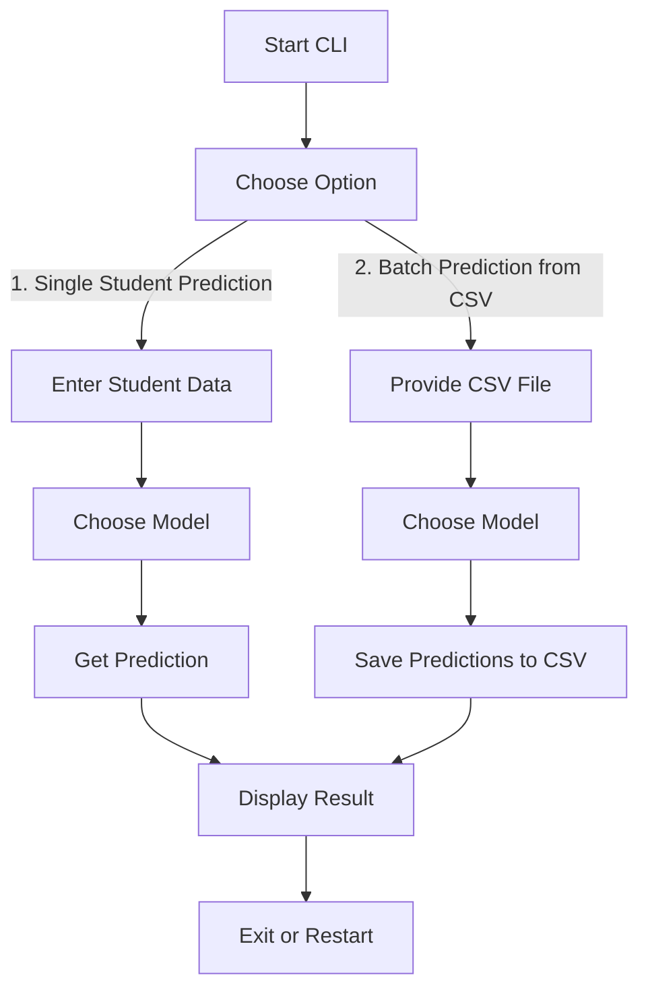
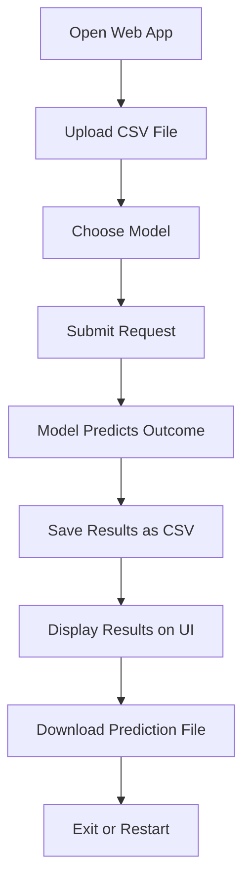

# Placement Prediction System

A machine learning system for predicting student placements using various models including MLP (Multi-Layer Perceptron), Logistic Regression, and SVC. The system provides both a CLI and web interface for making predictions.

## 📁 Repository Structure

```
mlp_assignment/
├── app.py              # Flask web application
├── cli.py              # Command-line interface application
├── Dockerfile          # Docker configuration
├── docker-compose.yml  # Docker Compose configuration
├── requirements.txt    # Python dependencies
├── models/            
│   ├── trained_models.pkl  # Trained ML models (LR, SVC)
│   └── best_model.h5      # Trained deep learning model
├── data/               # Directory for data files
│   ├── X_test.csv     # Test dataset
│   └── predictions_*.csv  # Generated predictions
└── README.md          # This file
```

## 🏗️ Model Architecture

### Multi-Layer Perceptron (MLP)
The deep learning model uses a 3-layer architecture:
```
Input Layer (10 features)
    ↓
Dense Layer (128 neurons, ReLU activation)
Dropout (0.3)
    ↓
Dense Layer (64 neurons, ReLU activation)
Dropout (0.3)
    ↓
Output Layer (2 neurons, Softmax activation)
```

### Other Models
- **Logistic Regression**: Binary classification with L2 regularization
- **Support Vector Classifier (SVC)**: Kernel-based classification

## 🚀 Setup and Installation

### Prerequisites
- Docker and Docker Compose
- Git

### Docker Image Setup

1. Pull the Docker image:
```bash
# Replace 'yourusername' with the actual Docker Hub username
docker pull yourusername/placement-prediction:latest
```

2. Create required directories:
```bash
mkdir -p data models
```

3. Place your model files in the models directory:
```bash
mv trained_models.pkl models/
mv best_model.h5 models/
```

4. Create a `.env` file with your Docker Hub username:
```bash
echo "DOCKER_USERNAME=yourusername" > .env
```

5. Run using Docker Compose:

For CLI application:
```bash
docker-compose run cli
```

For web application:
```bash
docker-compose up web
```

### Building and Pushing Docker Image

If you want to build and push your own version of the image:

1. Build the image:
```bash
docker build -t placement-prediction .
```

2. Tag the image:
```bash
docker tag placement-prediction yourusername/placement-prediction:latest
```

3. Login to Docker Hub:
```bash
docker login
```

4. Push the image:
```bash
docker push yourusername/placement-prediction:latest
```

## 🖥️ Using the Applications

### CLI Application (cli.py)

#### CLI Workflow


### Web Application (app.py)

#### Web App Workflow


## 📊 Input Data Format

The system expects CSV files with the following columns:
```
CGPA, Internships, Projects, Workshops/Certifications,
AptitudeTestScore, SoftSkillsRating, ExtracurricularActivities,
PlacementTraining, SSC_Marks, HSC_Marks
```

## 🔍 Troubleshooting

Common issues and solutions:

1. **Docker container fails to start**
   - Check if ports 5002 are available
   - Ensure model files are in the correct location

2. **Prediction errors**
   - Verify input data format matches requirements
   - Check if all required columns are present
   - Ensure values are within expected ranges

## 📝 License

This project is licensed under the MIT License - see the LICENSE file for details.

